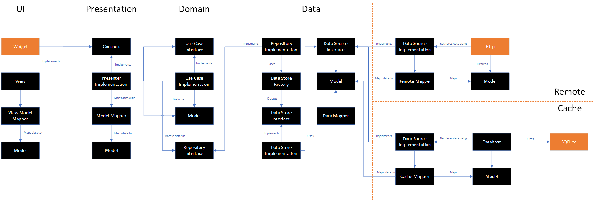

# Flutter Clean Architecture Example
An flutter teamplate project using clean architecture

Welcome, I hope this example is not only helpful to other developers, but also that it helps to educate in the area of architecture. I created this example for a few reasons:
1.	To experiment with modularization
2.	To share some approaches to clean architecture, especially as we've been talking a lot about it
3.	To use as a starting point in future projects where clean architecture feels appropriate
It is written 100% in Flutter/Dart with both UI and Unit tests – I’d like to keep this up-to-date as libraries change!

**Disclaimer**

Clean Architecture is not be appropriate for every project, so it is down to you to decide whether or not it fits your needs 

## Dependencies
```
  http: 0.12.0
  shared_preferences: ^0.4.3
  sqflite: ^1.0.0
  path_provider: ^0.4.1
  kiwi: ^0.1.0
 ```

## Architecture
The architecture of the project follows the principles of Clean Architecture. Here's how the sample project implements it:


The sample app when run will show you a simple list of hacker news (Same as the Flutter boring show https://www.youtube.com/watch?v=CPmN4-i9zC8&list=PLOU2XLYxmsIK0r_D-zWcmJ1plIcDNnRkK).


## Thanks
A special thanks to the authors involved with these two repositories, they were a great resource during my learning!
* https://github.com/android10/Android-CleanArchitecture
* https://github.com/bufferapp/android-clean-architecture-boilerplate
